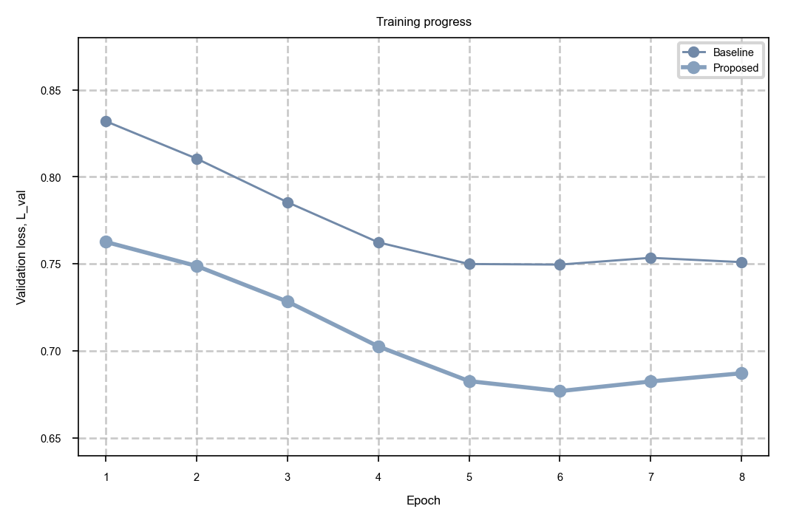
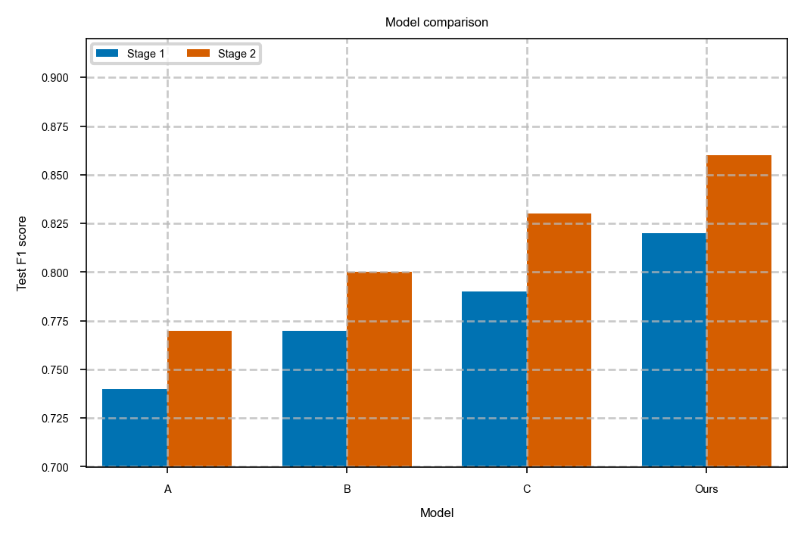
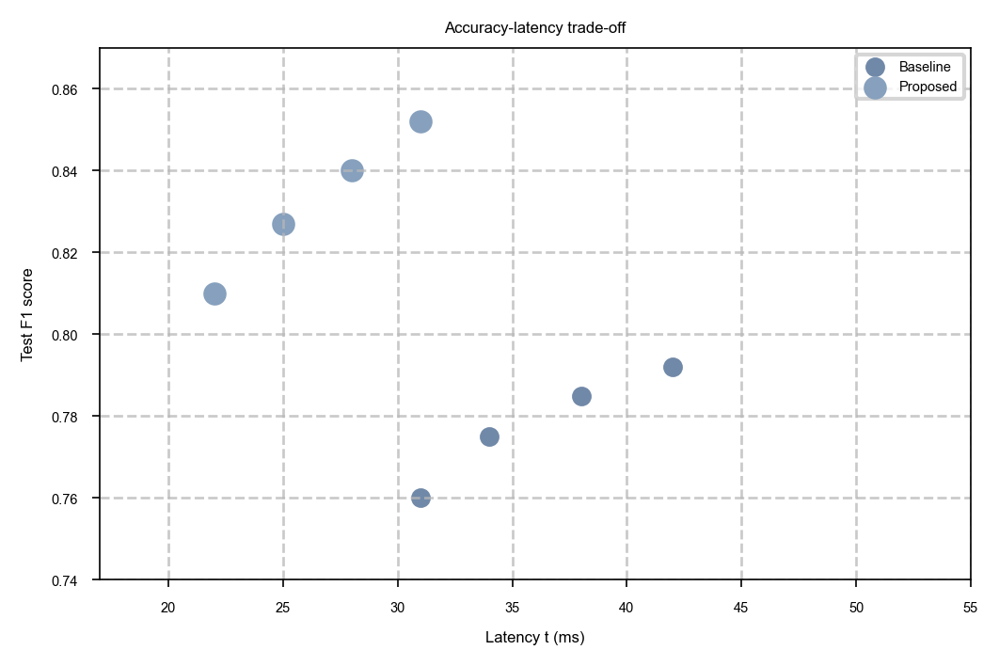
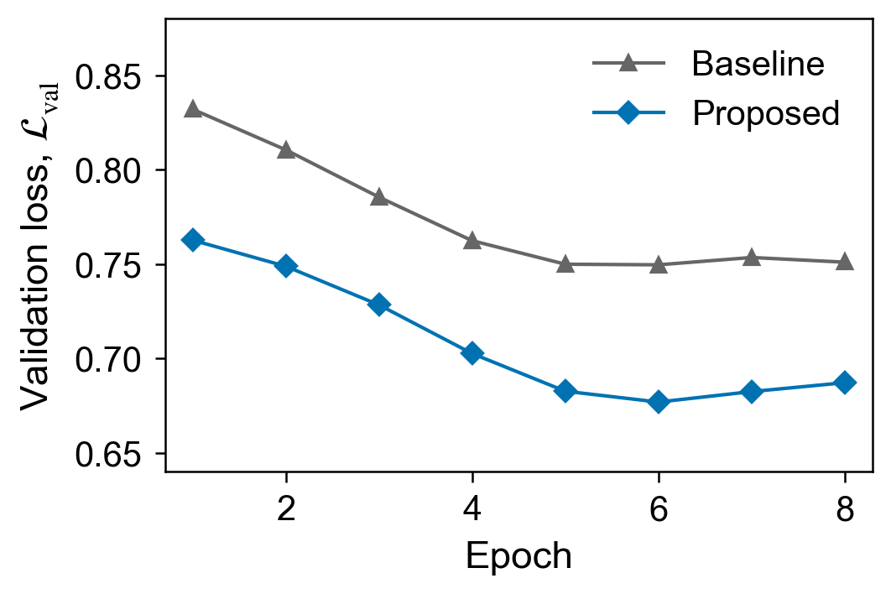
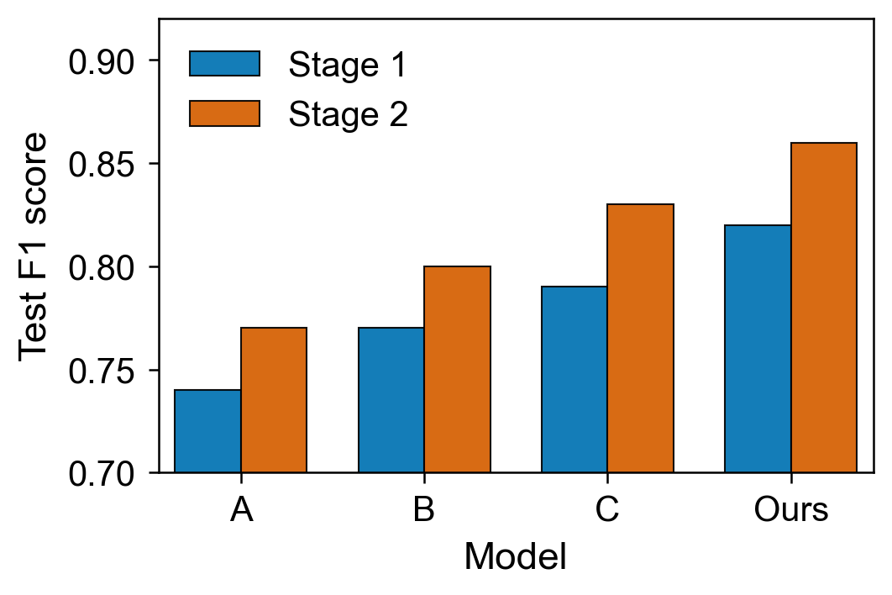
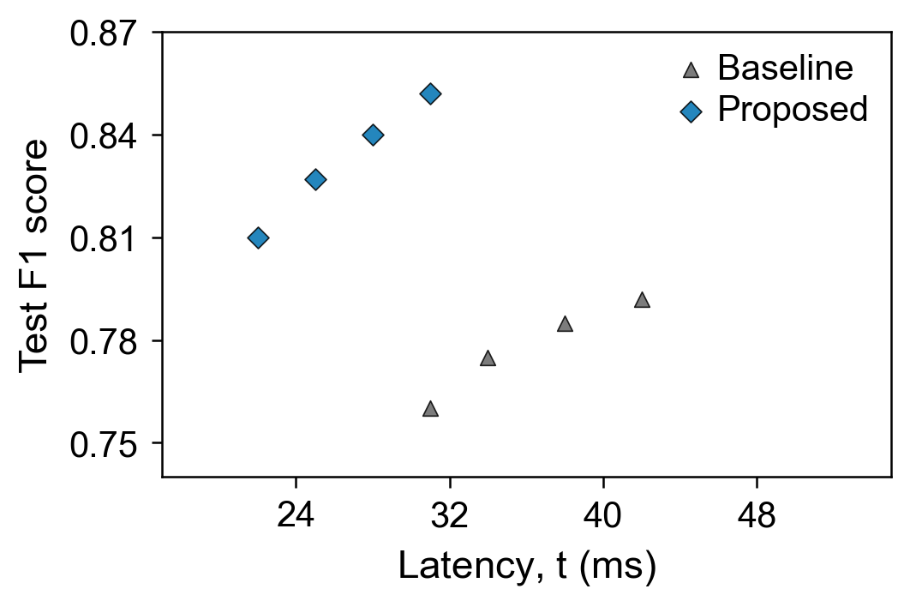

# elsevier-figure-style

[English](./README.md) | 简体中文

[](https://github.com/guhou-hvi/elsevier-figure-style/actions/workflows/ci.yml)
[](./LICENSE)
[](#发布状态)

**明明知道论文图片要符合期刊规范，为什么最后还是免不了返工？** 规范散落在不同地方，写作周期持续数月，导出结果与屏幕预览不一致，图片格式也会在不同脚本、工具和合作者之间逐渐偏离。

- **刚开始画图时：** 你想从第一张图就使用正确格式，却发现出版社说明、目标期刊要求和实际检查项并不集中在一个地方。
- **每次新画一张图时：** 你都要重新规定图幅、字体、线宽、图例和导出参数，而不能复用一套持续维护的 profile；刚开始科研时，这类重复工作尤其常见。
- **写作几个月后：** 你曾经查过字号、图幅和 DPI，但修改旧图或补画新图时，仍可能漏掉其中一项。
- **重新修改旧图时：** 复制来的脚本保留着过时或不一致的样式参数，一次简单的数据更新也会变成新一轮格式调整。
- **最终导出时：** 绘图代码看起来没有问题，缩到期刊栏宽后标签却看不清，输出文件还可能带着错误的分辨率、透明通道、颜色模式或图幅。
- **多人和多工具协作时：** 不同脚本、软件和合作者生成的图片，会逐渐在字体、配色、线宽和布局上失去一致性。
- **收到编辑或审稿意见后：** 对单张图或回复信所做的修正没有沉淀为可复用规则，同类意见仍可能在另一张图上再次出现。
- **更换目标期刊时：** 新的投稿目标意味着重新寻找、理解并统一应用另一套图片要求。

`elsevier-figure-style` 把这些容易遗忘的要求变成贯穿论文流程、可以反复执行的检查门槛。AI Agent 在生成定量结果图时应用统一 profile，在写作期间审查绘图代码和导出 metadata，并在投稿前按照最终尺寸检查导出效果。对于示意图和图形摘要，v0.1 审查 metadata 和最终渲染结果。项目内置一套有来源依据的 Elsevier 风格 manifest；替换 manifest 及其证据包即可将工作流迁移到其他期刊，新期刊引入全新规则类型时再扩展检测器。

|  | **线图** | **柱状图** | **散点图** |
|---|:---:|:---:|:---:|
| **修改前 / 临时格式** |  |  |  |
| **修改后 / profile 驱动** |  |  |  |

上方六张图使用相同的合成研究数据和坐标范围，线图、柱状图和散点图之间的对比只来自绘图格式。

这组对比展示了项目可以处理的五类问题：

- **最终尺寸可读性：** profile 统一文字和图形样式，Agent 按最终显示尺寸检查文字与元素是否清晰。
- **标题与公式：** helper 清除单面板图内标题；公式由 Agent 或绘图代码显式使用 MathText 排版。
- **版式与样式：** manifest 统一线宽、marker、柱形和刻度，并默认关闭装饰性网格。
- **系列与图例：** helper 提供色觉友好配色和不同 marker，Agent 通过视觉审查确认图例没有遮挡或越界。
- **导出检查：** helper 按 profile 生成投稿输出，metadata checker 自动检查位图；PDF、SVG 和 EPS 进入人工视觉审查流程。

重新生成并检查示例：

```bash
python examples/readme/generate_before_after.py
python skills/elsevier-figure-style/scripts/check_exported_figure_metadata.py --path examples/outputs/readme/bitmap --figure-type result --artwork-type line --target-layout one-half --profile editor
```

> 本项目由社区独立维护，是非官方工具，与 Elsevier 无隶属或认可关系。投稿时请核对目标期刊当前的 Guide for Authors。若不同语言版本措辞不一致，以英文 README 为准。

## 为什么需要它

图片要求会依次经过出版社和期刊说明、绘图代码、协作修改、论文排版以及最终导出，每次传递都可能引入格式偏差，等到投稿当天再检查已经太晚。`elsevier-figure-style` 提供一套持续运行、有来源依据并带有可追溯规则 ID 的审查机制，让每个阶段复用同一 profile。

它可以介入论文流程的四个阶段：

- **绘图阶段：** 在不同脚本出现大量临时样式之前，统一套用 matplotlib 或 ggplot2 profile。
- **论文写作阶段：** 修改定量结果图，并按照最终显示尺寸检查导出的示意图。
- **投稿前：** 合并源码检查、导出 metadata 检查和视觉 QA。
- **迁移到其他期刊时：** 切换版本化 manifest，并复用已有检测器和审查工作流。

## 两类图件

### 定量结果图

生成、修改和审查线图、不确定性带、热图、柱状/横向柱状图、散点图、Pareto/frontier 图、ablation curve 和其他指标类结果图。

Python 路径提供配置驱动 helper、基于 AST 的静态 checker、位图 metadata 检查和视觉 QA。R/ggplot2 支持配置驱动的 theme 与导出，但 v0.1 暂无 R 静态 checker。

### 原理和概念示意图

审查机制图、流程图、原理说明图、概念 panel 和图形摘要的可读性、重叠、对齐、panel label、视觉拥挤与导出 metadata。

v0.1 的示意图工作流覆盖审查。Skill 必须实际打开或渲染最终导出图后才能报告视觉 `PASS`；源文件编辑和重绘不在本版本范围内。

## 单一 Manifest 入口

默认 profile 由以下文件控制：

```text
skills/elsevier-figure-style/assets/elsevier_figure_style.json
```

该 manifest 包含 profile 身份、样式值、审查档位、导出阈值、检测器设置，以及规则证据和 checklist 文件的引用。Python、R 和两个 checker 均读取同一文件。

`bundle_root` 是 profile bundle 的安全边界，只允许设为 `.` 或 `..`；schema 和所有引用资源必须使用相对路径，并且不能越过该边界。
Python helper 在运行时始终使用自身携带的 schema 验证 manifest；profile 中的 `$schema` 必须在 bundle 内可解析，但不能替换运行时信任 schema。

已有期刊 profile bundle 之间只需通过一个参数切换：

```bash
python skills/elsevier-figure-style/scripts/check_elsevier_figure_style.py --path examples/python --config path/to/journal_profile.json --profile editor
```

一个新的期刊 profile 由 manifest 及其引用的证据和 checklist 文件组成。已有检测器的阈值、严重度、profile gate 和 override policy 均在 bundle 中配置；期刊引入新的规则类型时，需要实现对应的检测器代码。

## 规则档位与证据

- `official`：使用出版社官方规则和目标期刊说明，同时单独标记非政策类 `STYLE-*` 输入和工具接入问题。
- `editor`：在 `official` 基础上加入获授权的脱敏返修证据和核心视觉 QA，默认使用此档。
- `strict`：在 `editor` 基础上加入公开案例和完整视觉 QA checklist。

每条实质性发现都使用 `skills/elsevier-figure-style/references/source-basis/rule-registry.md` 中的规则 ID。D 级视觉检查保留明确的启发式标签，与 Elsevier 官方政策分开呈现。

## 快速开始

要求 Python 3.10 或更高版本。安装 Agent Skill：

```bash
npx skills add guhou-hvi/elsevier-figure-style
```

skills CLI 负责复制 Skill，Python 和 R 包需要单独安装。对于默认的 Codex 项目级安装，首次使用 Python 功能前请运行以下检查；其他 Agent 或全局安装需要调整基础目录：

```bash
python .agents/skills/elsevier-figure-style/scripts/check_environment.py
```

如果检查器报告缺少依赖，请在 Agent 实际运行脚本的 Python 环境中安装：

```bash
python -m pip install -r .agents/skills/elsevier-figure-style/requirements.txt
```

开发仓库时，请使用虚拟环境，然后安装开发依赖并验证本地 Skill 发现：

```bash
python -m pip install -r requirements-dev.txt
npx skills@1.5.15 add . --list
```

生成合成示例：

```bash
python examples/python/good_line_plot.py
python examples/python/good_heatmap.py
python examples/python/good_bar.py
python examples/python/good_scatter.py
```

运行 Python 源码审查：

```bash
python skills/elsevier-figure-style/scripts/check_elsevier_figure_style.py --path examples/python --profile editor
```

使用明确的 artwork 分类审查导出图：

```bash
python examples/schematic/generate_metadata_fixtures.py
python skills/elsevier-figure-style/scripts/check_exported_figure_metadata.py --path examples/outputs/schematic_demo.tiff --figure-type schematic --artwork-type combination --target-layout single --profile editor
```

两个 checker 默认在出现 `FAIL` 时返回非零退出码。使用 `--format json` 输出机器可读结果，使用 `--fail-on warn` 建立更严格的 CI gate，或使用 `--fail-on never` 仅生成报告。

## 项目本地 Python 配置

长期维护的绘图脚本不应依赖某台机器上的 Skill 安装路径。可以把所选 helper/profile bundle 初始化到目标项目：

```bash
python skills/elsevier-figure-style/scripts/init_figure_style_project.py --target path/to/project --config skills/elsevier-figure-style/assets/elsevier_figure_style.json --dry-run
python skills/elsevier-figure-style/scripts/init_figure_style_project.py --target path/to/project --config skills/elsevier-figure-style/assets/elsevier_figure_style.json
```

命令会创建 `path/to/project/figure_style/`。已有 bundle 默认保留；显式传入 `--force` 可将其替换。

```python
from figure_style import apply_journal_style, line_style_kwargs, save_figure

spec = apply_journal_style()
```

现有的 `apply_elsevier_style()` 和其他 v0.1 helper 名称继续兼容。

## R 快速开始

R 支持依赖 `ggplot2` 和 `jsonlite`：

```r
install.packages(c("ggplot2", "jsonlite"))
```

运行合成 demo：

```bash
Rscript examples/r/good_ggplot_demo.R
```

使用 `theme_journal()`、`journal_palette()` 和 `save_journal()` 获得共享 profile 行为。原有 Elsevier 命名别名继续可用。

## Prompt 示例

```text
使用 $elsevier-figure-style 按 editor 档从这个 CSV 生成一张论文线图。
```

```text
使用 $elsevier-figure-style 在 Elsevier 投稿前审查这个 matplotlib 脚本和导出的 TIFF。
```

```text
使用 $elsevier-figure-style 审查这张机制图；先渲染图片，再检查重叠和可读性，并报告规则 ID。
```

```text
使用 $elsevier-figure-style 和这个自定义期刊 profile JSON 修改结果图，但不要改变底层数据。
```

## 项目结构

```text
skills/elsevier-figure-style/
  SKILL.md
  requirements.txt
  agents/openai.yaml
  assets/
    elsevier_figure_style.json
    journal_figure_profile.schema.json
  scripts/
    elsevier_plot_style.py
    elsevier_theme.R
    check_elsevier_figure_style.py
    check_exported_figure_metadata.py
    init_figure_style_project.py
    check_environment.py
  references/
    source-basis/
examples/
tests/
docs/assets/
SECURITY.md
```

## 规范来源

默认 profile 将 Elsevier 当前公开说明中相对稳定的部分进行了可执行化整理：

- [Artwork and media instructions](https://www.elsevier.com/about/policies-and-standards/author/artwork-and-media-instructions)
- [Artwork overview](https://www.elsevier.com/about/policies-and-standards/author/artwork-and-media-instructions/artwork-overview)
- [Artwork formats checklist](https://www.elsevier.com/about/policies-and-standards/author/artwork-and-media-instructions/artwork-formats-checklist)
- [Artwork sizing](https://www.elsevier.com/about/policies-and-standards/author/artwork-and-media-instructions/artwork-sizing)
- [Artwork types](https://www.elsevier.com/about/policies-and-standards/author/artwork-and-media-instructions/artwork-types)
- [Artwork FAQ](https://www.elsevier.com/about/policies-and-standards/author/artwork-and-media-instructions/artwork-faq)
- [Graphical abstract guidance](https://www.elsevier.com/researcher/author/tools-and-resources/graphical-abstract)

内置来源最后核对日期为 2026-07-10。投稿前使用 checklist 完成检查，并以目标期刊当前的 Guide for Authors 作为最终依据。

## 参与贡献

欢迎贡献获授权、经过脱敏的编辑或审稿人图片格式意见。请提交可复用的转述，并移除原始私密通信、稿件标识、相关人员身份、未公开结果和保密技术内容。详见 [CONTRIBUTING.md](./CONTRIBUTING.md)。

安全漏洞请通过 [SECURITY.md](./SECURITY.md) 中的私密流程报告。

## 发布状态

`v0.1.0` 是公开公测版，范围包括：

- Python/matplotlib helper、源码检查和位图 metadata 检查。
- 配置驱动的 R/ggplot2 theme 与导出 helper。
- 面向最终导出图的 Agent 视觉 QA。
- 一个内置 Elsevier 风格 manifest 和可配置的内置检测器。

位图格式使用自动 metadata 检查；PDF、SVG 和 EPS 进入人工视觉审查流程。示意图覆盖审查，新检测器类型需要通过 Python 实现。v0.1 的静态源码检查面向 Python。

## 引用

如果本 Skill 为你的研究提供了帮助，请使用 [CITATION.cff](./CITATION.cff) 中的元数据引用本软件。在 GitHub 上可选择 **Cite this repository** 生成 APA 或 BibTeX 引用。

```bibtex
@software{ji_elsevier_figure_style_2026,
  author  = {Ji, Peng},
  title   = {elsevier-figure-style},
  version = {0.1.0},
  year    = {2026},
  url     = {https://github.com/guhou-hvi/elsevier-figure-style},
  license = {MIT}
}
```

## 许可

Copyright © 2026 Peng Ji and contributors. 本项目采用 [MIT License](./LICENSE)。
